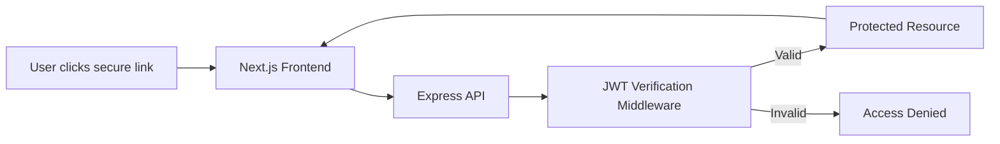

<div align="center">

<h1>🔗Deep Link System</h1>

<p>
A secure, scalable, and system-design–oriented deep linking platform inspired by real-world FAANG architectures.
</p>

<p>
  
  
  
  
</p>

<p>
  <a href="#-overview">Overview</a> •
  <a href="#-key-features">Features</a> •
  <a href="#-system-architecture">Architecture</a> •
  <a href="#-project-structure">Structure</a> •
  <a href="#-getting-started">Setup</a>
</p>

</div>

---

## 📌 Overview

This project demonstrates how **secure deep linking systems** are designed in real-world production environments.

The system enables **time-bound, token-secured deep links** that allow users to directly access protected resources without traditional login flows — similar to **magic links**, **secure report URLs**, or **email-based authentication systems** used by large-scale platforms.

The focus of this project is not only functionality, but **system design principles**, including:

* Security
* Scalability
* Stateless architecture
* Fault tolerance
* Clean separation of concerns

---

## 🎯 Problem Statement

Traditional deep links are vulnerable to:

* URL tampering
* Unauthorized access
* Replay attacks
* Session coupling

This system solves those problems using:

* Cryptographically signed JWTs
* Middleware-based validation
* Stateless backend design
* Centralized error handling

---

## 🎨 Key Features

* 🔐 **JWT-Signed Deep Links**
  Secure, time-bound access tokens embedded in URLs

* 🛡️ **Middleware-Driven Security**
  Authentication logic isolated from business logic

* ⚡ **Low-Latency Verification**
  Token verification optimized for fast response times

* 📊 **Derived Runtime Metrics**
  Trust score, latency, and session stats derived from verification logs

* 🧩 **Stateless Backend Architecture**
  Fully scalable across multiple server instances

* 🎨 **Modern UI Dashboard**
  Clean, glassmorphic dashboard for analytics and verification feedback

---

## 🏗 System Architecture

The system follows a **decoupled client–server architecture**.

### 🔁 High-Level Flow



---

## 🧠 Core System Design Decisions

### 1️⃣ Security — Middleware Interceptor Pattern

**Problem**
Embedding authentication logic inside every controller increases risk and code duplication.

**Solution**
All token verification is handled by a **dedicated authentication middleware** before requests reach business logic.

**Impact**

* Fail-fast request rejection
* Reduced attack surface
* Clean separation of concerns

---

### 2️⃣ Scalability — Stateless Backend

**Problem**
Server-side sessions prevent horizontal scaling and create single points of failure.

**Solution**
All request state is embedded in JWTs. The server stores **no session data**.

**Impact**

* Horizontal scalability
* Load-balancer friendly
* Cloud-native readiness

---

### 3️⃣ Consistency — Atomic Operations

**Problem**
Concurrent access can cause race conditions (e.g., double-use links).

**Solution**
Counters and state changes are designed to use **atomic database operations** instead of read-modify-write logic.

**Impact**

* Strong data consistency
* No application-level locking
* High-throughput safe design

---

### 4️⃣ Resilience — Centralized Error Handling

**Problem**
Uncaught exceptions crash servers and expose stack traces.

**Solution**
All errors are normalized and handled in a **global error layer**.

**Impact**

* Predictable API responses
* Improved observability
* Safer production behavior

---

## 🛠️ Tech Stack

| Layer    | Technology           | Purpose                     |
| -------- | -------------------- | --------------------------- |
| Frontend | Next.js (App Router) | Routing, UI, SEO            |
| Backend  | Node.js              | Runtime                     |
| API      | Express.js           | REST APIs                   |
| Security | JWT, CORS, Helmet    | Authentication & protection |
| Styling  | Tailwind CSS         | Modern UI                   |
| Logging  | Custom + Console     | Verification metrics        |

---

## 📂 Project Structure

```bash
DeepLinkSystem/
│
├── client/                     # Frontend (Next.js)
│   ├── src/
│   │   ├── app/
│   │   │   ├── page.js         # Deep Link Generator
│   │   │   ├── verify/         # Token verification route
│   │   │   └── dashboard/      # Protected dashboard
│   │   ├── components/
│   │   │   ├── Navbar.js
│   │   │   └── StatsCard.js
│   │   └── lib/
│   │       └── api.js          # Axios instance
│
├── server/                     # Backend (Node + Express)
│   └── src/
│       ├── controllers/
│       │   └── linkController.js
│       ├── middleware/
│       │   └── authMiddleware.js
│       └── routes/
│           └── linkRoutes.js
│
└── README.md
```

---

## 🚀 Getting Started

### 1️⃣ Clone Repository

```bash
git clone https://github.com/adityasinghr651/DeepLinkSystem.git
cd DeepLinkSystem
```

---

### 2️⃣ Backend Setup

```bash
cd server
npm install
```

Create `.env` file:

```env
PORT=5000
JWT_SECRET=your_secret_key
FRONTEND_URL=http://localhost:3000
```

Start server:

```bash
npm run dev
```

---

### 3️⃣ Frontend Setup

```bash
cd client
npm install
npm run dev
```

Frontend runs at:

```
http://localhost:3000
```

---

## 📡 API Reference

### Generate Deep Link

```http
POST /api/links/generate
```

### Verify Deep Link

```http
POST /api/links/verify
```

### System Metrics

```http
GET /api/links/stats
```

## 👤 Author

**Aditya Singh**
🎓 B.Tech CSE
💡 Interests: System Design, Full-Stack Development, AI
🔗 GitHub: [https://github.com/adityasinghr651](https://github.com/adityasinghr651)

---

<div align="center">
  <sub>Built with ❤️ using real-world system design principles</sub>
</div>
